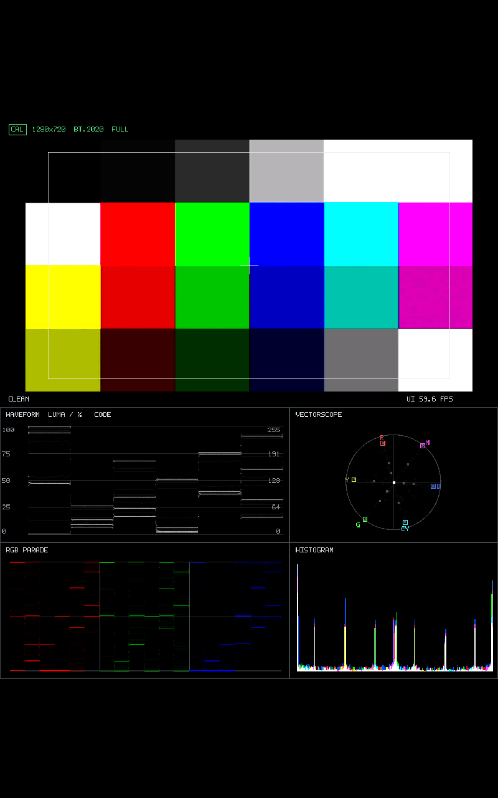
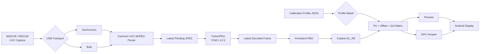

# Android UVC Field Monitor

Android端末をUSB Video Class（UVC）キャプチャデバイスと組み合わせて使用するための、実験的なフィールドモニター実装です。

一般的なAndroid動画再生パイプラインに依存せず、USB入力からMJPEGデコード、GPU描画、映像解析までをNative C++中心で構成し、**低レイテンシ・最新フレーム優先・リアルタイム映像解析**を重視しています。

現在は主に **MS2109 / MS2130 系USBキャプチャデバイス**を対象として開発・検証しています。

[English](README_en.md) | 日本語

---

## スクリーンショット



---

## 概要

このプロジェクトでは、Android端末を簡易的な映像確認用ディスプレイではなく、映像信号を解析できる**フィールドモニター**として使用することを目標としています。

主な設計方針：

- UVC映像入力の低レイテンシ処理
- FIFOに古いフレームを滞留させない
- 完全なフレーム保持よりも「現在に近い映像」を優先
- Native C++によるUSBキャプチャ
- OpenGL ESによるGPU描画
- CPUコピーの削減
- 1280×720 MJPEG入力
- ISO / BULK transportの自動選択
- TurboJPEGによるplanar YCbCr 4:2:2 decode
- GPUを利用したリアルタイム映像解析
- SDR / HDR(PQ) Preview
- Capture Calibration Profile Format v1のImport / Apply
- 実機上でのレイテンシ計測と最適化

旧720×480 YUYV fallbackは現行baselineから削除し、MS2109 / MS2130とも共通の720p60 MJPEG decode/render経路を使用します。

---

## 主な機能

### UVCキャプチャ

- libusbを使用したNative UVCキャプチャ
- 非同期USB転送
- UVC VideoStreaming interface / endpoint探索
- ISO / BULK transfer type判定
- MS2109 / MS2130系デバイス向け処理
- 1280×720 MJPEG 約60 fps
- latest pending JPEG
- TurboJPEGによるMJPEGデコード
- decode失敗フレームのdrop

### 映像表示

- OpenGL ESによるNative描画
- planar Y / Cb / Cr 3-plane texture
- アスペクト比維持
- フルスクリーン表示
- イベント駆動レンダリング
- 最新フレーム優先表示
- Persistent Mapped PBO ×2

### HDR Preview

ImportしたCalibration ProfileでTransfer Characteristicsが`PQ`と指定されている場合、PreviewのみHDR→SDR変換を行います。

```text
JPEG YCbCr
  ↓
BT.601 limited-range → R'G'B'
  ↓
Capture Calibration（Offset＋3×3 Matrix）
  ↓
PQ EOTF
  ↓
HDR-to-SDR Tone Mapping
  ↓
BT.2020 → BT.709
  ↓
sRGB
```

PQコードはST 2084の絶対輝度として解釈します。現在のTone Mappingは203 nitをSDR reference whiteとする簡易実装です。

Scope側にはPQ EOTF / Tone Mappingを入れず、Capture補正後のcode-domain信号を保持します。

### 映像スコープ

現在、以下の映像解析表示を実装しています。

- Waveform Monitor
- RGB Parade
- Histogram
- Vectorscope

フィールドでの露出確認、レベル確認、色分布確認をAndroid端末単体で行うことを目的としています。

- WaveformはFull Range固定で、左に`0 / 25 / 50 / 75 / 100 %`、右に`code 0 / 64 / 128 / 191 / 255`を表示
- Waveform / RGB Parade / Vectorscopeは平方根密度表示。Waveformの密度基準は入力高と同じ720 sample
- HistogramはR/G/Bチャンネル別の平方根表示で、code 0 / 255のクリッピングbinを強調
- Vectorscopeは100% targetを維持し、ProfileのBT.601 / BT.709 / BT.2020色度係数を使用
- Graticuleを先に、測定信号を最後に描画するため、交点でも信号を確認可能

---

## Capture Calibration Profile

別APKのUVC Capture Calibrationが生成したProfile Format v1 JSONを読み込み、キャプチャデバイス固有のPU値とRGB補正を適用できます。

Androidの常駐通知にある`LOAD`からCalibration AppがExportしたJSONを選択します。正常なProfileはアプリ内部へ保存され、次回起動時に再読込されます。通知の`UNLOAD`は保存Profileを削除し、補正を無効化します。画面内にImportボタンは置きません。

Profile未読込時は画面上のCAL badgeをグレー表示します。正常に読み込まれると緑の`CAL` badgeとともに、Profileの解像度、Colorimetry、FULL / LIMITEDを表示します。

```text
UVC Capture
  ↓
Profile Match
  ↓
Brightness / Contrast / Saturation / Hue
  ↓
BT.601 limited-range YCbCr → R'G'B'
  ↓
RGB Offset＋3×3 Matrix
  ├─ Preview
  └─ Waveform / RGB Parade / Histogram / Vectorscope
```

Field MonitorではCalibration Search、Matrix Solve、Patch Recognitionを行いません。完成済みProfileの照合と適用だけを行います。

### Profile Matching

少なくとも次の条件を検証します。

- Profile Format Versionが1
- VID / PIDが接続Deviceと一致
- ProfileにSerialがある場合、接続DeviceのSerialと一致
- Pixel FormatがMJPEG
- Resolutionが1280×720
- Frame Rateが60
- Input Encodingが`RGB` / `YCBCR_444` / `YCBCR_422`
- Rangeが`FULL` / `LIMITED`
- Colorimetryが`BT601` / `BT709` / `BT2020`
- Transfer Characteristicsが`SDR` / `PQ`
- Validation Resultが`CALIBRATION_VALID`または`CALIBRATION_POOR_FIT`

不一致時は補間や推測を行わず、PU書込みとRGB補正を無効化します。詳細理由はLogcatへ記録し、画面下部へ詳細エラー文字列は表示しません。

Input ContractはProfileを現在の運用モードとして採用する方式です。HDMI InfoFrameやHDR Static Metadataから入力信号を自動判定し、Profile記載値と照合する機能は現時点ではありません。Import前に、実際の送信側設定とProfileのInput Contractが一致していることを確認してください。

`CALIBRATION_POOR_FIT` Profileも比較・微調整用途のため適用できますが、画面上に品質状態を残します。

### SDRとPQの処理

| 処理 | SDR | PQ |
|---|---|---|
| Capture補正 | code-domain | code-domain |
| Waveform / Parade / Histogram | 補正後コード値 | 補正後PQコード値 |
| Vectorscope | 補正後RGBから再生成 | 補正後PQ RGBコードから再生成 |
| Preview | 補正後RGBを表示 | PQ EOTF、Tone Mapping、BT.2020→BT.709、sRGB |

ScopesにはEOTFやTone Mappingを適用しません。PQ Previewだけが絶対輝度へ変換されます。

詳細は[Capture Calibration Profile適用（Phase 8）](docs/Capture_Calibration_Profile_Apply_Phase8.md)を参照してください。

---

## アーキテクチャ



USB transportだけを分離し、UVC MJPEG payload以降のdecode / render / scope処理は共通化しています。

---

## 低レイテンシ設計

一般的な動画再生用途では、フレームの欠落を防ぐために複数段のキューやバッファリングが利用されます。

一方、フィールドモニターでは古いフレームを完全に再生することより、

> 今カメラに映っているものを、できるだけ早く表示する

ことを重視します。

そのため本プロジェクトでは、入力フレームをFIFOへ蓄積せず、**最新フレームを優先し、処理が追いつかない場合は古いフレームを破棄**します。

```text
latest wins
busy -> skip
no video FIFO
```

decode error frameはrendererへpublishせず、前回の正常表示を保持します。

---

## Diagnostic / Logging

Native診断機能はCMakeの`UVCFM_ENABLE_DIAGNOSTICS`で一括制御し、通常ビルドでは`OFF`です。

```text
-DUVCFM_ENABLE_DIAGNOSTICS=ON
```

`OFF`ではEGL frame timestamp / presentation timing、USB・TurboJPEG周期統計、Scope SSBO readback検証、Colorbar / Range解析を実行しません。UVC PROBE / COMMIT、機能fallback、初期化失敗やtransport errorなど運用に必要な処理とエラーログは維持します。

---

## Android端末依存性

UVC動作はキャプチャデバイスだけでなく、Android端末側のUSB Host、VBUS、OTGアダプタ、コネクタ、USB PHY / signal integrity等にも依存します。

MS2109系の実機評価では、同一キャプチャデバイス・同一映像でもAndroid端末を変更するとMJPEG decode error / 局所フリッカーが再現しなくなるケースを確認しています。

このケースではthermal要因は再現せず、端末側hardware条件の影響が疑われます。電源品質とsignal integrityのどちらが支配的かは未確定です。

---

## 使用技術

### Android / Native

- Android
- Kotlin
- Android NDK
- C++
- CMake

### USB

- libusb

### Graphics

- OpenGL ES
- EGL

### JPEG

- libjpeg-turbo
- TurboJPEG API

---

## 対象アーキテクチャ

現在のビルド対象は、

```text
arm64-v8a
```

です。

現在同梱している`libturbojpeg.a`が`arm64-v8a`用であるため、Gradle側でもABIを明示的に制限しています。

```kotlin
defaultConfig {
    ndk {
        abiFilters += "arm64-v8a"
    }
}
```

他のABIへ対応する場合は、それぞれのABI向けにTurboJPEGライブラリを用意する必要があります。

---

## ビルド環境

必要な主な環境：

- Android Studio
- Android SDK
- Android NDK
- CMake
- Ninja
- arm64-v8a Android端末
- UVC対応USBキャプチャデバイス

本プロジェクトはNativeコードを含むため、通常のAndroid/Kotlinのみのプロジェクトとは異なり、Android NDK環境が必要です。

---

## Third-party libraries

### libusb

libusbのソースコードをリポジトリ内に含めています。

```text
app/src/main/cpp/third_party/libusb/
```

使用バージョン：

```text
libusb v1.0.30
```

Upstream:

```text
https://github.com/libusb/libusb
```

License:

```text
LGPL-2.1-or-later
```

libusbはアプリケーション本体とは分離した共有ライブラリ`usb-1.0`としてビルドし、Native側からリンクしています。

### libjpeg-turbo / TurboJPEG

MJPEGデコードにはlibjpeg-turboのTurboJPEG APIを使用しています。

使用バージョン：

```text
libjpeg-turbo 3.2.0
```

現在は`arm64-v8a`向けの`libturbojpeg.a`を使用しています。

Upstream:

```text
https://github.com/libjpeg-turbo/libjpeg-turbo
```

ライセンス情報：

```text
THIRD_PARTY_NOTICES.md
LICENSES/libjpeg-turbo/LICENSE.md
LICENSES/libjpeg-turbo/README.ijg
```

This software is based in part on the work of the Independent JPEG Group.

---

## ライセンス

UvcFieldMonitorのオリジナルコードは **MIT License** のもとで公開しています。

```text
LICENSE
```

第三者ライブラリには、それぞれ独立したライセンスが適用されます。

```text
THIRD_PARTY_NOTICES.md
LICENSES/
```

MIT Licenseがlibusbやlibjpeg-turboのコードへ適用されるものではありません。

---

## 配布について

このリポジトリでは**ソースコードを公開します**。

現時点では、ビルド済みAPK/AABの配布は予定していません。

実機環境、USBキャプチャデバイス、Android端末、OS、USBホストコントローラ等の違いによって、動作やレイテンシは変化する可能性があります。

---

## 注意事項

このプロジェクトは現在も開発・検証中です。

特に以下については環境依存があります。

- UVCデバイスの実装
- USB転送方式
- Android端末のUSB Host性能
- VBUS / OTG / cable / signal integrity
- GPU / OpenGL ES実装
- ディスプレイのリフレッシュレート
- Androidの描画・Presentation経路
- キャプチャデバイス固有の映像処理
- Calibration ProfileのCapture Mode / Input Contract不一致

すべてのUVCデバイスおよびAndroid端末での動作を保証するものではありません。

MS2109 / MS2130系デバイスについても、製品やファームウェア、接続するAndroid hostによって挙動が異なる可能性があります。

---

## Repository layout

```text
UvcFieldMonitor/
├─ README.md
├─ README_en.md
├─ LICENSE
├─ THIRD_PARTY_NOTICES.md
├─ LICENSES/
│  └─ libjpeg-turbo/
│     ├─ LICENSE.md
│     └─ README.ijg
│
├─ docs/
│  ├─ Capture_Calibration_Profile_Apply_Phase8.md
│  └─ images/
│     └─ uvc-field-monitor.png
│
├─ app/
│  └─ src/main/
│     └─ cpp/
│        ├─ calibration_profile.cpp
│        ├─ diagnostic_config.h
│        ├─ uvc_device.cpp
│        ├─ uvc_stream.cpp
│        ├─ uvc_mjpeg_decoder.cpp
│        ├─ scope_gpu.cpp
│        ├─ scope_ui.cpp
│        └─ third_party/
│           ├─ libusb/
│           └─ libjpeg-turbo/
│
├─ gradle/
├─ build.gradle.kts
├─ settings.gradle.kts
└─ .gitignore
```

---

## Status

開発中。

現在のbaselineは、**MS2109 / MS2130の1280×720p60 MJPEG入力を共通TurboJPEG / planar YCbCr / OpenGL ES経路で処理し、Capture Calibration ProfileをGPU PreviewとScopesへ適用する構成**です。

低レイテンシUVC入力、HDR Preview、GPU映像スコープ、および複数Android hostでの実機検証を継続しています。
