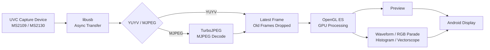

# Android UVC Field Monitor

Android端末を、USB Video Class（UVC）キャプチャデバイスと組み合わせて使用するための、実験的なフィールドモニター実装です。

一般的なAndroidの動画再生パイプラインに依存せず、USB入力からデコード、GPU描画、映像解析までをNative C++中心で構成し、**低レイテンシ・最新フレーム優先・リアルタイム映像解析**を重視しています。

現在は主に **MS2109 / MS2130 系USBキャプチャデバイス**を対象として開発・検証しています。

[English](README_en.md) | 日本語

---

## スクリーンショット


---

## 概要

このプロジェクトでは、Android端末を簡易的な映像確認用ディスプレイではなく、映像信号を解析できる**フィールドモニター**として使用することを目標としています。

主な設計方針は以下の通りです。

- UVC映像入力の低レイテンシ処理
- FIFOに古いフレームを滞留させない
- 完全なフレーム保持よりも「現在に近い映像」を優先
- Native C++によるUSBキャプチャ処理
- OpenGL ESによるGPU描画
- CPUコピーの削減
- YUYV / MJPEG入力への対応
- GPUを利用したリアルタイム映像解析
- 実機上でのレイテンシ計測と最適化

---

## 主な機能

### UVCキャプチャ

- libusbを使用したNative UVCキャプチャ
- 非同期USB転送
- 最新フレーム優先のフレーム管理
- MS2109 / MS2130系デバイス向け処理
- YUYV入力
- MJPEG入力
- TurboJPEGによるMJPEGデコード

### 映像表示

- OpenGL ESによるNative描画
- アスペクト比維持
- フルスクリーン表示
- イベント駆動レンダリング
- 最新フレーム優先表示

### 映像スコープ

現在、以下の映像解析表示を実装しています。

- Waveform Monitor
- RGB Parade
- Histogram
- Vectorscope

フィールドでの露出確認、レベル確認、色分布確認をAndroid端末単体で行うことを目的としています。

---

## アーキテクチャ



本プロジェクトでは、処理が一時的に表示周期へ追いつかなくなった場合でも、古い映像を順番に表示するのではなく、可能な限り**最新の入力フレームへ追従すること**を優先しています。

---

## 低レイテンシ設計

一般的な動画再生用途では、フレームの欠落を防ぐために複数段のキューやバッファリングが利用されます。

一方、フィールドモニターでは古いフレームを完全に再生することより、

> 今カメラに映っているものを、できるだけ早く表示する

ことを重視します。

そのため本プロジェクトでは、入力されたフレームを無条件にFIFOへ蓄積するのではなく、**最新フレームを優先し、処理が追いつかない場合は古いフレームを破棄する**設計を採用しています。

USB入力、デコード、GPU転送、レンダリング、Presentationまでを個別に計測できるようにし、ボトルネックを確認しながら最適化しています。

---

## 使用技術

### Android / Native

- Android
- Kotlin
- Android NDK
- C++
- CMake

### USB

- libusb

### Graphics

- OpenGL ES
- EGL

### JPEG

- libjpeg-turbo
- TurboJPEG API

---

## 対象アーキテクチャ

現在のビルド対象は、

```text
arm64-v8a
```

です。

現在同梱している `libturbojpeg.a` が `arm64-v8a` 用であるため、Gradle側でもABIを明示的に制限しています。

```kotlin
defaultConfig {
    ndk {
        abiFilters += "arm64-v8a"
    }
}
```

他のABIへ対応する場合は、それぞれのABI向けにTurboJPEGライブラリを用意する必要があります。

---

## ビルド環境

必要な主な環境：

- Android Studio
- Android SDK
- Android NDK
- CMake
- Ninja
- arm64-v8a Android端末
- UVC対応USBキャプチャデバイス

本プロジェクトはNativeコードを含むため、通常のAndroid/Kotlinのみのプロジェクトとは異なり、Android NDK環境が必要です。

---

## Third-party libraries

### libusb

libusbのソースコードをリポジトリ内に含めています。

```text
app/src/main/cpp/third_party/libusb/
```

使用バージョン：

```text
libusb v1.0.30
```

Upstream:

```text
https://github.com/libusb/libusb
```

本リポジトリでは公式upstreamの `v1.0.30` タグを使用しています。

License:

```text
LGPL-2.1-or-later
```

libusbはアプリケーション本体とは分離した共有ライブラリ `usb-1.0` としてビルドし、Native側からリンクしています。

---

### libjpeg-turbo / TurboJPEG

MJPEGデコードにはlibjpeg-turboのTurboJPEG APIを使用しています。

使用バージョン：

```text
libjpeg-turbo 3.2.0
```

現在は `arm64-v8a` 向けの `libturbojpeg.a` を使用しています。

Upstream:

```text
https://github.com/libjpeg-turbo/libjpeg-turbo
```

ライセンス情報については以下を参照してください。

```text
THIRD_PARTY_NOTICES.md
LICENSES/libjpeg-turbo/LICENSE.md
LICENSES/libjpeg-turbo/README.ijg
```

This software is based in part on the work of the Independent JPEG Group.

---

## ライセンス

UvcFieldMonitorのオリジナルコードは **MIT License** のもとで公開しています。

詳細は以下を参照してください。

```text
LICENSE
```

第三者ライブラリには、それぞれ独立したライセンスが適用されます。

```text
THIRD_PARTY_NOTICES.md
LICENSES/
```

MIT Licenseがlibusbやlibjpeg-turboのコードへ適用されるものではありません。

---

## 配布について

このリポジトリでは**ソースコードを公開します**。

現時点では、ビルド済みAPK/AABの配布は予定していません。

実機環境、USBキャプチャデバイス、Android端末、OS、USBホストコントローラ等の違いによって、動作やレイテンシは変化する可能性があります。

---

## 注意事項

このプロジェクトは現在も開発・検証中です。

特に以下については環境依存があります。

- UVCデバイスの実装
- USB転送方式
- Android端末のUSBホスト性能
- GPU / OpenGL ES実装
- ディスプレイのリフレッシュレート
- Androidの描画・Presentation経路
- キャプチャデバイス固有の映像処理

すべてのUVCデバイスおよびAndroid端末での動作を保証するものではありません。

MS2109 / MS2130系デバイスについても、製品やファームウェアによって挙動が異なる可能性があります。

---

## Repository layout

```text
UvcFieldMonitor/
├─ README.md
├─ README_ja.md
├─ LICENSE
├─ THIRD_PARTY_NOTICES.md
├─ LICENSES/
│  └─ libjpeg-turbo/
│     ├─ LICENSE.md
│     └─ README.ijg
│
├─ docs/
│  └─ images/
│     └─ uvc-field-monitor.png
│
├─ app/
│  └─ src/main/
│     └─ cpp/
│        └─ third_party/
│           ├─ libusb/
│           └─ libjpeg-turbo/
│
├─ gradle/
├─ build.gradle.kts
├─ settings.gradle.kts
└─ .gitignore
```

---

## Status

開発中。

低レイテンシUVC入力、Native描画、映像スコープ、およびMS2109/MS2130系キャプチャデバイスでの実機検証を継続しています。
