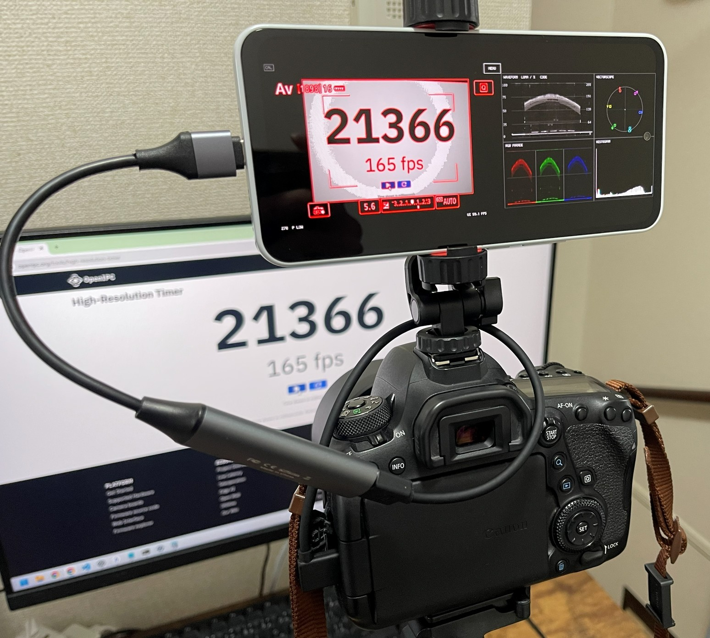
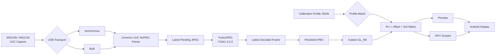

# Android UVC Field Monitor

An experimental field-monitor implementation for Android devices combined with USB Video Class (UVC) capture devices.

Instead of relying on a typical Android video playback pipeline, the project handles USB capture, MJPEG decoding, GPU rendering, and video analysis primarily in native C++. The design prioritizes **low latency, latest-frame processing, and real-time video scopes**.

Development and validation currently focus mainly on **MS2109 / MS2130-class USB capture devices**.

English | [日本語](README.md)

---

## Screenshot


---

## Usage example



---

## Overview

The goal of this project is to use an Android device not merely as a video preview display, but as a **field monitor capable of real-time signal analysis**.

Key design goals:

- Low-latency UVC capture
- No stale-frame accumulation in FIFO queues
- Prefer the newest frame over complete frame preservation
- Native C++ USB capture
- OpenGL ES GPU rendering
- Reduced CPU-side copying
- 1280×720 MJPEG input
- ISO / BULK transport selection from descriptors
- TurboJPEG planar YCbCr 4:2:2 decoding
- GPU-assisted real-time video analysis
- SDR / HDR(PQ) preview
- Capture Calibration Profile Format v1 import and application
- On-device latency measurement and optimization

The legacy 720×480 YUYV fallback has been removed from the current baseline. MS2109 / MS2130-class devices now share the same 720p60 MJPEG decode/render path.

---

## Features

### UVC capture

- Native UVC capture using libusb
- Asynchronous USB transfers
- UVC VideoStreaming interface / endpoint discovery
- ISO / BULK transfer-type selection
- MS2109 / MS2130-class device handling
- 1280×720 MJPEG at approximately 60 fps
- Latest-pending JPEG semantics
- MJPEG decoding via TurboJPEG
- Decode-failed frames are dropped

### Video display

- Native OpenGL ES rendering
- Planar Y / Cb / Cr 3-plane textures
- Aspect-ratio preservation
- Full-screen rendering
- Event-driven rendering
- Latest-frame-first presentation
- Persistent mapped PBO ×2

### HDR preview

When the input mode is known or selected as PQ, HDR-to-SDR conversion is applied to the preview path only.

```text
YCbCr
  ↓
PQ EOTF
  ↓
HDR-to-SDR Tone Mapping
  ↓
BT.2020 → BT.709
  ↓
sRGB
```

The scope path does not apply PQ EOTF or tone mapping. It keeps decoded code-domain values, or calibration-corrected code-domain values when a profile is active.

### Video scopes

Currently implemented:

- Waveform Monitor
- RGB Parade
- Histogram
- Vectorscope

The scopes are intended for field exposure checks, signal-level checks, and color-distribution monitoring directly on an Android device.

- The waveform uses a fixed full-range scale: `0 / 25 / 50 / 75 / 100 %` and `code 0 / 64 / 128 / 191 / 255`.
- Waveform, RGB Parade, and Vectorscope use square-root density rendering with gains of `1.5 / 1.5 / 1.75`, respectively. The waveform reference population is 720 source rows.
- The per-channel square-root histogram emphasizes clipping bins at code 0 and 255.
- The vectorscope uses exact one-bin rendering and 100% targets, while BT.601 / BT.709 / BT.2020 chroma coefficients follow the loaded profile.
- Graticules are drawn before measured traces so signals remain visible at intersections.

---

### Monitor UI / Preview Assist

Open `MENU` in the upper-right corner, release `LOCK`, and use F1–F4 to select an assist. Tap the same function key again to cycle its main preset, or select a preset directly from the list on the left.

- F1 Zebra: `OFF / 70 / 80 / 90 / 95 / 100 IRE`
- F2 Peaking: `OFF / LOW / MID / HIGH` plus MONO variants, with red edge highlights
- F3 False Color: `OFF / VIDEO / HDR NITS`; HDR NITS is available only with a PQ profile
- F4 Frame: `OFF / 16:9 / 1.85 / 2.00 / 2.39 / 4:3 / 1:1 / 9:16`, Center Cross, and 90% Safe Area

False Color suppresses the visible Zebra and Peaking overlays without discarding their selected states.

---

## Capture Calibration Profile

The monitor imports Profile Format v1 JSON generated by the companion calibration application and applies device PU values plus RGB offset/matrix correction.

Use `LOAD` in the persistent Android notification to select a profile. A valid profile is saved internally and restored on the next launch. `UNLOAD` deletes the saved profile, disables correction, and reopens the active USB session when necessary. There is no in-app import button.

With no profile loaded, the on-screen CAL badge is gray. A valid loaded profile changes it to a green `CAL` badge and displays the profile resolution, colorimetry, and FULL / LIMITED range. Detailed validation failures are written to Logcat instead of a lower-screen status panel.

Matching validates profile version, VID/PID, optional serial, MJPEG 1280×720 at 60 fps, input encoding, range, colorimetry, transfer characteristics, and validation result. No interpolation or partial matching is performed.

PQ EOTF and tone mapping remain preview-only. Scopes operate on corrected code-domain values.

---

## Architecture



Only the USB transport is separated. UVC MJPEG parsing, decoding, rendering, and scope processing are shared after the transport layer.

---

## Low-latency design

General-purpose video playback systems often use multi-stage buffering to avoid frame loss.

For a field monitor, however, the more important requirement is:

> Show what the camera is seeing now as quickly as possible.

The project therefore avoids building a normal video FIFO. When processing falls behind, older frames can be discarded so that rendering catches up to the latest frame.

```text
latest wins
busy -> skip
no video FIFO
```

Frames that fail JPEG decoding are not published to the renderer, so the previous valid image remains visible.

---

## Latency Measurement

Screen-to-screen (glass-to-glass) latency was measured on real hardware using 240 fps high-speed video.

A high-frame-rate stopwatch was displayed on a Windows PC and viewed through the EOS 6D Mark II Live View path. The Windows display and the target display were recorded in the same shot with an iPhone 12 Pro Max at 240 fps, and latency was obtained from the displayed timestamp difference within the same recorded frame.

```text
Windows display
  ↓
EOS 6D Mark II
  ├─ Rear Live View LCD
  └─ HDMI → MS2130 → Android UVC Field Monitor → Android display
```

### Measured results

| Measurement path | Windows display | Target display | Latency |
|---|---:|---:|---:|
| Windows display → EOS 6D Mark II Live View LCD | 10362 ms | 10303 ms | **59 ms** |
| Windows display → EOS 6D Mark II → MS2130 → Teclast P30T 120 Hz | 7463 ms | 7335 ms | **128 ms** |
| Windows display → EOS 6D Mark II → MS2130 → ZTE A202ZT 60 Hz | 1924 ms | 1658 ms | **266 ms** |

With the same EOS 6D Mark II and MS2130, the P30T 120 Hz configuration measured **138 ms lower latency, or approximately 52% less glass-to-glass latency**, than the A202ZT 60 Hz configuration.

A simple subtraction of the 59 ms rear-LCD measurement from the 128 ms P30T result leaves approximately 69 ms:

```text
128 ms - 59 ms ≈ 69 ms
```

This approximately 69 ms value must not be treated as a precise standalone latency figure for the MS2130 + Android application. This measurement does not establish that the EOS 6D Mark II rear-LCD path and HDMI-output path have identical internal timing, so the value is only a differential reference.

The 128 ms result includes camera capture and Live View processing, HDMI output, MS2130 capture processing, USB transfer, MJPEG decoding, OpenGL ES rendering, the Android display pipeline, and LCD output. It therefore represents **end-to-end glass-to-glass latency for the tested shooting configuration**, not application-only processing latency.

Measured latency can vary with the camera, HDMI output mode, capture device, Android host, display refresh rate, Android rendering/composition path, and panel characteristics.

---

## Diagnostics / logging

Native diagnostics are controlled by the CMake option `UVCFM_ENABLE_DIAGNOSTICS`, which defaults to `OFF`.

```text
-DUVCFM_ENABLE_DIAGNOSTICS=ON
```

When disabled, the application does not enable or query EGL frame timestamps and does not run presentation timing, periodic USB/TurboJPEG statistics, scope SSBO readback validation, or Colorbar/Range analysis. Required UVC PROBE/COMMIT operations, runtime fallbacks, and operational error reporting remain active.

---

## Android host dependency

UVC behavior depends not only on the capture device but also on the Android USB host implementation, VBUS quality, OTG adapter, connector, cable, USB PHY, and signal integrity.

During MS2109-class testing, a case was observed in which MJPEG decode errors and localized flicker occurred on one Android host but disappeared when the same capture hardware and source were moved to another Android device.

Thermal behavior did not reproduce the issue in that case, so host-side hardware conditions are suspected. Whether power quality or signal integrity is dominant remains unconfirmed.

---

## Technology

### Android / Native

- Android
- Kotlin
- Android NDK
- C++
- CMake

### USB

- libusb

### Graphics

- OpenGL ES
- EGL

### JPEG

- libjpeg-turbo
- TurboJPEG API

---

## Target ABI

The current build target is:

```text
arm64-v8a
```

The bundled `libturbojpeg.a` is built for `arm64-v8a`, so the Android build is explicitly restricted to that ABI:

```kotlin
defaultConfig {
    ndk {
        abiFilters += "arm64-v8a"
    }
}
```

Supporting additional ABIs requires corresponding TurboJPEG binaries.

---

## Build environment

Main requirements:

- Android Studio
- Android SDK
- Android NDK
- CMake
- Ninja
- arm64-v8a Android device
- UVC-compatible USB capture device

Because the project contains native code, an Android NDK environment is required in addition to a normal Android/Kotlin setup.

---

## Third-party libraries

### libusb

The libusb source code is vendored in:

```text
app/src/main/cpp/third_party/libusb/
```

Version:

```text
libusb v1.0.30
```

Upstream:

```text
https://github.com/libusb/libusb
```

License:

```text
LGPL-2.1-or-later
```

libusb is built as a separate shared library (`usb-1.0`) and linked from the application's native library.

### libjpeg-turbo / TurboJPEG

MJPEG decoding uses the TurboJPEG API provided by libjpeg-turbo.

Version:

```text
libjpeg-turbo 3.2.0
```

The current project uses an `arm64-v8a` `libturbojpeg.a`.

Upstream:

```text
https://github.com/libjpeg-turbo/libjpeg-turbo
```

License information:

```text
THIRD_PARTY_NOTICES.md
LICENSES/libjpeg-turbo/LICENSE.md
LICENSES/libjpeg-turbo/README.ijg
```

This software is based in part on the work of the Independent JPEG Group.

---

## License

Original UvcFieldMonitor source code is released under the **MIT License**.

```text
LICENSE
```

Third-party components remain subject to their own independent licenses:

```text
THIRD_PARTY_NOTICES.md
LICENSES/
```

The MIT License for UvcFieldMonitor does not relicense libusb or libjpeg-turbo.

---

## Distribution

This repository distributes **source code only**.

Prebuilt APK/AAB packages are not currently planned.

Behavior and latency may vary depending on the Android device, operating system, USB host controller, capture hardware, GPU, display pipeline, and physical USB connection.

---

## Notes

This project is still under development and validation.

Behavior may depend on:

- UVC device implementation
- USB transfer mode
- Android USB host performance
- VBUS / OTG adapter / cable / signal integrity
- GPU / OpenGL ES implementation
- Display refresh rate
- Android rendering/presentation path
- Capture-device-specific processing

Operation is not guaranteed on every UVC device or Android device.

MS2109 / MS2130-class devices may also behave differently depending on product implementation, firmware, and the Android host they are connected to.

---

## Repository layout

```text
UvcFieldMonitor/
├─ README.md
├─ README_en.md
├─ LICENSE
├─ THIRD_PARTY_NOTICES.md
├─ LICENSES/
│  └─ libjpeg-turbo/
│     ├─ LICENSE.md
│     └─ README.ijg
│
├─ docs/
│  └─ images/
│     └─ uvc-field-monitor.png
│
├─ app/
│  └─ src/main/
│     └─ cpp/
│        ├─ calibration_profile.cpp
│        ├─ diagnostic_config.h
│        ├─ uvc_device.cpp
│        ├─ uvc_stream.cpp
│        ├─ uvc_mjpeg_decoder.cpp
│        ├─ scope_gpu.cpp
│        ├─ scope_ui.cpp
│        └─ third_party/
│           ├─ libusb/
│           └─ libjpeg-turbo/
│
├─ gradle/
├─ build.gradle.kts
├─ settings.gradle.kts
└─ .gitignore
```

---

## Status

Under development.

The current baseline processes **1280×720p60 MJPEG from MS2109 / MS2130-class devices through a shared TurboJPEG / planar YCbCr / OpenGL ES pipeline**.

Validation continues for low-latency UVC capture, HDR preview, GPU video scopes, and behavior across multiple Android USB hosts.
