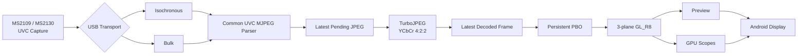

# Android UVC Field Monitor

An experimental field-monitor implementation for Android devices combined with USB Video Class (UVC) capture devices.

Instead of relying on a typical Android video playback pipeline, the project handles USB capture, MJPEG decoding, GPU rendering, and video analysis primarily in native C++. The design prioritizes **low latency, latest-frame processing, and real-time video scopes**.

Development and validation currently focus mainly on **MS2109 / MS2130-class USB capture devices**.

English | [日本語](README.md)

---

## Screenshot


---

## Overview

The goal of this project is to use an Android device not merely as a video preview display, but as a **field monitor capable of real-time signal analysis**.

Key design goals:

- Low-latency UVC capture
- No stale-frame accumulation in FIFO queues
- Prefer the newest frame over complete frame preservation
- Native C++ USB capture
- OpenGL ES GPU rendering
- Reduced CPU-side copying
- 1280×720 MJPEG input
- ISO / BULK transport selection from descriptors
- TurboJPEG planar YCbCr 4:2:2 decoding
- GPU-assisted real-time video analysis
- SDR / HDR(PQ) preview
- On-device latency measurement and optimization

The legacy 720×480 YUYV fallback has been removed from the current baseline. MS2109 / MS2130-class devices now share the same 720p60 MJPEG decode/render path.

---

## Features

### UVC capture

- Native UVC capture using libusb
- Asynchronous USB transfers
- UVC VideoStreaming interface / endpoint discovery
- ISO / BULK transfer-type selection
- MS2109 / MS2130-class device handling
- 1280×720 MJPEG at approximately 60 fps
- Latest-pending JPEG semantics
- MJPEG decoding via TurboJPEG
- Decode-failed frames are dropped

### Video display

- Native OpenGL ES rendering
- Planar Y / Cb / Cr 3-plane textures
- Aspect-ratio preservation
- Full-screen rendering
- Event-driven rendering
- Latest-frame-first presentation
- Persistent mapped PBO ×2

### HDR preview

When the input mode is known or selected as PQ, HDR-to-SDR conversion is applied to the preview path only.

```text
YCbCr
  ↓
PQ EOTF
  ↓
HDR-to-SDR Tone Mapping
  ↓
BT.2020 → BT.709
  ↓
sRGB
```

The scope path does not apply PQ EOTF or tone mapping. It keeps decoded source-domain code values.

### Video scopes

Currently implemented:

- Waveform Monitor
- RGB Parade
- Histogram
- Vectorscope

The scopes are intended for field exposure checks, signal-level checks, and color-distribution monitoring directly on an Android device.

---

## Architecture



Only the USB transport is separated. UVC MJPEG parsing, decoding, rendering, and scope processing are shared after the transport layer.

---

## Low-latency design

General-purpose video playback systems often use multi-stage buffering to avoid frame loss.

For a field monitor, however, the more important requirement is:

> Show what the camera is seeing now as quickly as possible.

The project therefore avoids building a normal video FIFO. When processing falls behind, older frames can be discarded so that rendering catches up to the latest frame.

```text
latest wins
busy -> skip
no video FIFO
```

Frames that fail JPEG decoding are not published to the renderer, so the previous valid image remains visible.

---

## Diagnostics / logging

Normal builds keep Logcat output relatively quiet and retain mainly:

```text
USB transport statistics
TurboJPEG statistics
warning / error
```

Per-frame latency, detailed presentation timing, scope-queue logs, and Colorbar / Range diagnostics are disabled by default.

---

## Android host dependency

UVC behavior depends not only on the capture device but also on the Android USB host implementation, VBUS quality, OTG adapter, connector, cable, USB PHY, and signal integrity.

During MS2109-class testing, a case was observed in which MJPEG decode errors and localized flicker occurred on one Android host but disappeared when the same capture hardware and source were moved to another Android device.

Thermal behavior did not reproduce the issue in that case, so host-side hardware conditions are suspected. Whether power quality or signal integrity is dominant remains unconfirmed.

---

## Technology

### Android / Native

- Android
- Kotlin
- Android NDK
- C++
- CMake

### USB

- libusb

### Graphics

- OpenGL ES
- EGL

### JPEG

- libjpeg-turbo
- TurboJPEG API

---

## Target ABI

The current build target is:

```text
arm64-v8a
```

The bundled `libturbojpeg.a` is built for `arm64-v8a`, so the Android build is explicitly restricted to that ABI:

```kotlin
defaultConfig {
    ndk {
        abiFilters += "arm64-v8a"
    }
}
```

Supporting additional ABIs requires corresponding TurboJPEG binaries.

---

## Build environment

Main requirements:

- Android Studio
- Android SDK
- Android NDK
- CMake
- Ninja
- arm64-v8a Android device
- UVC-compatible USB capture device

Because the project contains native code, an Android NDK environment is required in addition to a normal Android/Kotlin setup.

---

## Third-party libraries

### libusb

The libusb source code is vendored in:

```text
app/src/main/cpp/third_party/libusb/
```

Version:

```text
libusb v1.0.30
```

Upstream:

```text
https://github.com/libusb/libusb
```

License:

```text
LGPL-2.1-or-later
```

libusb is built as a separate shared library (`usb-1.0`) and linked from the application's native library.

### libjpeg-turbo / TurboJPEG

MJPEG decoding uses the TurboJPEG API provided by libjpeg-turbo.

Version:

```text
libjpeg-turbo 3.2.0
```

The current project uses an `arm64-v8a` `libturbojpeg.a`.

Upstream:

```text
https://github.com/libjpeg-turbo/libjpeg-turbo
```

License information:

```text
THIRD_PARTY_NOTICES.md
LICENSES/libjpeg-turbo/LICENSE.md
LICENSES/libjpeg-turbo/README.ijg
```

This software is based in part on the work of the Independent JPEG Group.

---

## License

Original UvcFieldMonitor source code is released under the **MIT License**.

```text
LICENSE
```

Third-party components remain subject to their own independent licenses:

```text
THIRD_PARTY_NOTICES.md
LICENSES/
```

The MIT License for UvcFieldMonitor does not relicense libusb or libjpeg-turbo.

---

## Distribution

This repository distributes **source code only**.

Prebuilt APK/AAB packages are not currently planned.

Behavior and latency may vary depending on the Android device, operating system, USB host controller, capture hardware, GPU, display pipeline, and physical USB connection.

---

## Notes

This project is still under development and validation.

Behavior may depend on:

- UVC device implementation
- USB transfer mode
- Android USB host performance
- VBUS / OTG adapter / cable / signal integrity
- GPU / OpenGL ES implementation
- Display refresh rate
- Android rendering/presentation path
- Capture-device-specific processing

Operation is not guaranteed on every UVC device or Android device.

MS2109 / MS2130-class devices may also behave differently depending on product implementation, firmware, and the Android host they are connected to.

---

## Repository layout

```text
UvcFieldMonitor/
├─ README.md
├─ README_en.md
├─ LICENSE
├─ THIRD_PARTY_NOTICES.md
├─ LICENSES/
│  └─ libjpeg-turbo/
│     ├─ LICENSE.md
│     └─ README.ijg
│
├─ docs/
│  └─ images/
│     └─ uvc-field-monitor.png
│
├─ app/
│  └─ src/main/
│     └─ cpp/
│        ├─ uvc_device.cpp
│        ├─ uvc_stream.cpp
│        ├─ uvc_mjpeg_decoder.cpp
│        ├─ scope_gpu.cpp
│        ├─ scope_ui.cpp
│        └─ third_party/
│           ├─ libusb/
│           └─ libjpeg-turbo/
│
├─ gradle/
├─ build.gradle.kts
├─ settings.gradle.kts
└─ .gitignore
```

---

## Status

Under development.

The current baseline processes **1280×720p60 MJPEG from MS2109 / MS2130-class devices through a shared TurboJPEG / planar YCbCr / OpenGL ES pipeline**.

Validation continues for low-latency UVC capture, HDR preview, GPU video scopes, and behavior across multiple Android USB hosts.
