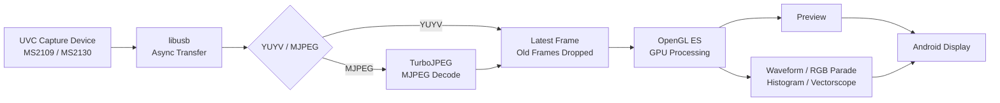

# Android UVC Field Monitor

An experimental field-monitor implementation for Android devices combined with USB Video Class (UVC) capture devices.

Instead of relying on a typical Android video playback pipeline, the project handles USB capture, decoding, GPU rendering, and video analysis primarily in native C++. The design prioritizes **low latency, latest-frame processing, and real-time video scopes**.

Development and validation currently focus mainly on **MS2109 / MS2130-class USB capture devices**.

English | [日本語](README.md)

---

## Screenshot


---

## Overview

The goal of this project is to use an Android device not merely as a video preview display, but as a **field monitor capable of real-time signal analysis**.

Key design goals:

- Low-latency UVC video capture
- Prevent stale frames from accumulating in FIFO queues
- Prefer the most recent frame over complete frame preservation
- Native C++ USB capture
- OpenGL ES GPU rendering
- Reduced CPU-side copying
- YUYV / MJPEG input support
- GPU-assisted real-time video analysis
- On-device latency measurement and optimization

---

## Features

### UVC capture

- Native UVC capture using libusb
- Asynchronous USB transfers
- Latest-frame-first frame management
- Device-specific handling for MS2109 / MS2130-class hardware
- YUYV input
- MJPEG input
- MJPEG decoding via TurboJPEG

### Video display

- Native rendering with OpenGL ES
- Aspect-ratio preservation
- Full-screen rendering
- Event-driven rendering
- Latest-frame-first presentation

### Video scopes

Currently implemented:

- Waveform Monitor
- RGB Parade
- Histogram
- Vectorscope

These scopes are intended for field exposure checks, signal-level checks, and color-distribution monitoring directly on an Android device.

---

## Architecture



If the processing pipeline temporarily falls behind the input rate, the system does not try to display every stale frame in sequence. It instead prioritizes following the **most recent available input frame**.

---

## Low-latency design

General-purpose video playback systems often use multi-stage buffering to avoid frame loss.

For a field monitor, however, the more important requirement is:

> Show what the camera is seeing now as quickly as possible.

For that reason, this project does not blindly preserve every incoming frame in a FIFO queue. When processing falls behind, **older frames may be discarded so that rendering can catch up to the latest frame**.

The pipeline is structured so that USB input, decoding, GPU upload, rendering, and presentation can be measured separately, allowing latency bottlenecks to be identified and optimized.

---

## Technology

### Android / Native

- Android
- Kotlin
- Android NDK
- C++
- CMake

### USB

- libusb

### Graphics

- OpenGL ES
- EGL

### JPEG

- libjpeg-turbo
- TurboJPEG API

---

## Target ABI

The current build target is:

```text
arm64-v8a
```

The bundled `libturbojpeg.a` is built for `arm64-v8a`, so the Android build is explicitly restricted to that ABI:

```kotlin
defaultConfig {
    ndk {
        abiFilters += "arm64-v8a"
    }
}
```

Supporting additional ABIs requires corresponding TurboJPEG binaries for those ABIs.

---

## Build environment

Main requirements:

- Android Studio
- Android SDK
- Android NDK
- CMake
- Ninja
- arm64-v8a Android device
- UVC-compatible USB capture device

Because this project contains native code, an Android NDK environment is required in addition to a normal Android/Kotlin development setup.

---

## Third-party libraries

### libusb

The libusb source code is vendored in:

```text
app/src/main/cpp/third_party/libusb/
```

Version:

```text
libusb v1.0.30
```

Upstream:

```text
https://github.com/libusb/libusb
```

This repository uses the official upstream `v1.0.30` tag.

License:

```text
LGPL-2.1-or-later
```

libusb is built as a separate shared library (`usb-1.0`) and linked from the application's native library.

---

### libjpeg-turbo / TurboJPEG

MJPEG decoding uses the TurboJPEG API provided by libjpeg-turbo.

Version:

```text
libjpeg-turbo 3.2.0
```

The current project uses an `arm64-v8a` `libturbojpeg.a`.

Upstream:

```text
https://github.com/libjpeg-turbo/libjpeg-turbo
```

License information:

```text
THIRD_PARTY_NOTICES.md
LICENSES/libjpeg-turbo/LICENSE.md
LICENSES/libjpeg-turbo/README.ijg
```

This software is based in part on the work of the Independent JPEG Group.

---

## License

Original UvcFieldMonitor source code is released under the **MIT License**.

See:

```text
LICENSE
```

Third-party components remain subject to their own independent licenses:

```text
THIRD_PARTY_NOTICES.md
LICENSES/
```

The MIT License for UvcFieldMonitor does not relicense libusb or libjpeg-turbo.

---

## Distribution

This repository distributes **source code only**.

Prebuilt APK/AAB packages are not currently planned.

Behavior and latency may vary depending on the Android device, operating system, USB host controller, capture hardware, GPU, and display pipeline.

---

## Notes

This project is still under development and validation.

Behavior may depend on:

- UVC device implementation
- USB transfer mode
- Android USB host performance
- GPU / OpenGL ES implementation
- Display refresh rate
- Android rendering/presentation path
- Capture-device-specific processing

Operation is not guaranteed on every UVC device or Android device.

MS2109 / MS2130-class devices may also behave differently depending on product implementation and firmware.

---

## Repository layout

```text
UvcFieldMonitor/
├─ README.md
├─ README_ja.md
├─ LICENSE
├─ THIRD_PARTY_NOTICES.md
├─ LICENSES/
│  └─ libjpeg-turbo/
│     ├─ LICENSE.md
│     └─ README.ijg
│
├─ docs/
│  └─ images/
│     └─ uvc-field-monitor.png
│
├─ app/
│  └─ src/main/
│     └─ cpp/
│        └─ third_party/
│           ├─ libusb/
│           └─ libjpeg-turbo/
│
├─ gradle/
├─ build.gradle.kts
├─ settings.gradle.kts
└─ .gitignore
```

---

## Status

Under development.

Low-latency UVC input, native rendering, video scopes, and real-device validation with MS2109 / MS2130-class capture hardware are continuing.
